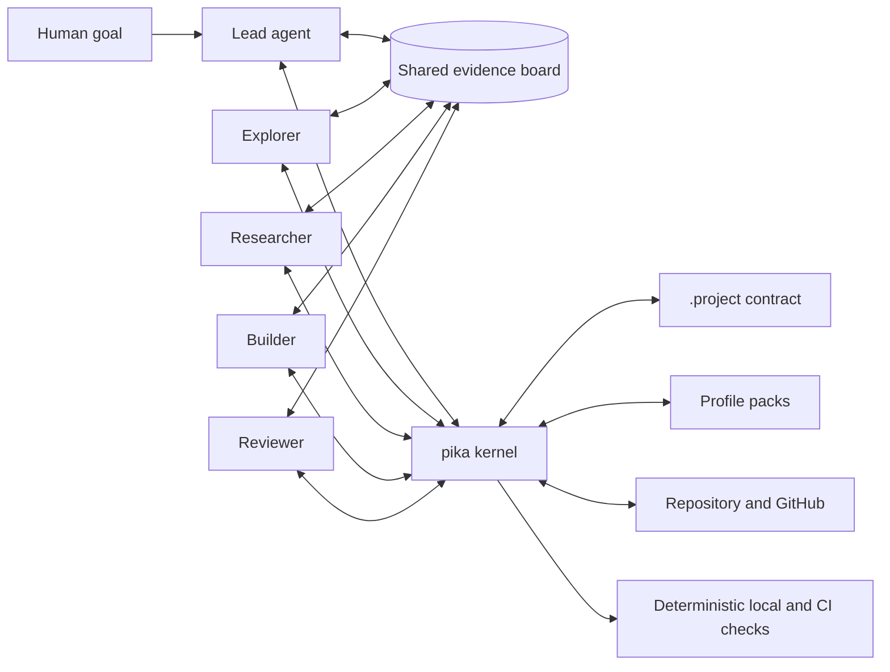
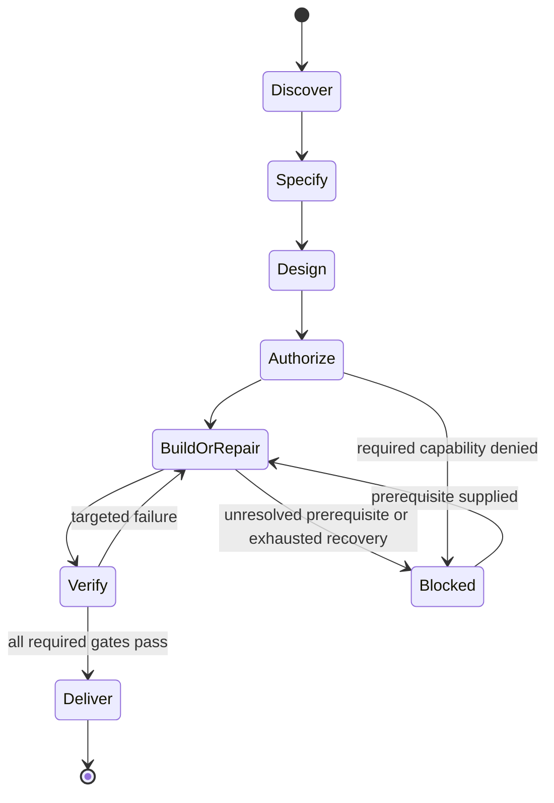

# pika Design Specification

**Status:** Design approved; specification awaiting user review
**Date:** 2026-08-28
**Product:** `pika`

## 1. Purpose

`pika` is a provider-neutral project operating system for creating new repositories, adopting existing repositories, and guiding feature work, bug repair, review, verification, delivery, and maintenance.

It combines:

- an AI-driven lead agent and named collaborators;
- a small native CLI that safely inspects and changes repositories;
- adaptive stack and project-kind profiles;
- a durable repository contract;
- deterministic local and GitHub CI verification;
- public-safe specifications, decisions, plans, sources, and evidence.

The system solves a recurring problem: repository conventions, architecture records, agent instructions, quality commands, and GitHub workflows are usually assembled ad hoc from many unrelated examples. `pika` provides one coherent workflow while preserving valid ecosystem and repository conventions.

## 2. Goals

1. Initialize a maintainable new repository without empty enterprise boilerplate.
2. Adopt an existing repository without blindly restructuring working code.
3. Support TypeScript/JavaScript, Python, Swift, Rust, and Go deeply in the first release.
4. Support both single-project repositories and mixed-language monorepos.
5. Let named agents from different providers collaborate through explicit roles and durable state.
6. Run autonomously after one capability authorization at the start of a work run.
7. Use current patterns from public GitHub repositories while recording provenance and validating local fit.
8. Keep the same deterministic checks available locally and in GitHub Actions.
9. Commit useful, sanitized development evidence while retaining raw execution data locally.
10. Make every rule explainable and every generated file owned by a command or profile.

## 3. Non-goals

The first release does not provide:

- a permanent collaboration server, social workspace, or web dashboard;
- general remote-agent scheduling;
- organization-wide fleet governance;
- a universal source-code directory tree;
- automatic adoption of a pattern solely because its repository is popular;
- raw transcript publication;
- security-program features such as threat modeling, SAST, SBOM generation, dependency policy, signing, RBAC, or deployment hardening.

A later optional security pack may add the deferred security-program features. V1 retains only repository integrity controls required to avoid lost work and accidental public disclosure: previews, rollback, repository-bound paths, and credential redaction.

## 4. Design Principles

### 4.1 Adaptive, not universal

The durable repository spine is consistent. Source and test layouts are selected by stack profiles and existing conventions. A Swift project is not forced into a Python `src/` layout, and an established repository is not renamed for cosmetic conformity.

### 4.2 One obvious workflow

`pika work "<goal>"` is the normal entry point for features, fixes, and maintenance. Specialized commands expose mechanics, not competing development methodologies.

### 4.3 AI decides; the kernel transacts

The AI lead may research, reason, select an architecture, decompose work, select collaborators, and propose changes. Only the native kernel may validate a contract, reserve write ownership, apply a change set, roll it back, or issue a deterministic verification receipt.

### 4.4 Evidence beats consensus

Agent discussion is advisory. Source state, executable checks, reproduced behavior, primary documentation, and recorded decisions determine completion.

### 4.5 Parallelize independent work

Read-only exploration and review may fan out freely within the authorized budget. Writers run in parallel only when their scopes are disjoint or isolated and their shared interfaces were established first.

### 4.6 Lean defaults, composable packs

New repositories receive the core contract, essential documentation, GitHub CI, agent guidance, and stack checks. Additional project-kind and capability packs are installed only when relevant.

### 4.7 Public-safe history

Specifications, plans, adopted sources, decisions, and verification evidence are committed in sanitized form. Raw prompts, tool output, machine paths, credentials, caches, and transient agent messages remain local.

## 5. System Architecture



### 5.1 Native CLI kernel

The kernel is a single cross-platform Go binary. It owns:

- repository discovery and classification;
- strict contract parsing and schema validation;
- profile composition and version locking;
- repository inventory and change planning;
- deterministic previews and diffs;
- capability-envelope enforcement;
- write-scope leases;
- transactional apply, journal, recovery, and rollback;
- verification command execution and result normalization;
- redaction and public evidence generation;
- JSON output for automation;
- MCP server mode for agent-native use;
- local coordination-board access.

The kernel contains no autonomous design policy. It exposes facts and guarded operations to the agent layer.

### 5.2 Agent workflow layer

The workflow layer consists of portable Agent Skills and role definitions. It owns:

- understanding user intent;
- requirements clarification when necessary;
- local architecture discovery;
- external documentation and GitHub pattern research;
- architectural decisions and ADR proposals;
- task decomposition and dependency ordering;
- provider/model selection by role;
- implementation and repair strategy;
- reviewer synthesis;
- bounded recovery decisions;
- documentation and diagram impact analysis.

### 5.3 Repository contract

The committed `.project/contract.yaml` is the project-level source of truth. It declares:

- contract schema version;
- repository topology and packages;
- selected profile packs;
- canonical source, test, generated, and documentation paths;
- naming rules and accepted exceptions;
- declared build, format, lint, typecheck, test, smoke, and release commands;
- diagram and documentation triggers;
- agent role-to-runtime mappings;
- allowed workflow side effects;
- evidence publication policy;
- GitHub merge and release policy.

Parsing is strict:

- duplicate YAML keys are rejected;
- unknown keys are rejected except beneath an explicit `extensions` map;
- paths are repository-relative and normalized;
- profile versions are pinned in `.project/profiles.lock`;
- exceptions require a rule ID, rationale, owner, and review condition.

Illustrative shape:

```yaml
schema: 1
project:
  name: sample-service
  topology: workspace
profiles:
  - core@1
  - typescript@1
  - api@1
packages:
  api:
    root: apps/api
    profiles: [typescript@1, api@1]
commands:
  format: pnpm format
  lint: pnpm lint
  typecheck: pnpm typecheck
  test: pnpm test
  smoke: pnpm smoke
agents:
  lead:
    runtime: omp
  builder:
    runtime: codex
  reviewer:
    runtime: omp
    provider: openrouter
    model: anthropic/claude-sonnet-4-5
github:
  merge: squash
evidence:
  publish: sanitized
extensions: {}
```

Values in this example are replaceable configuration, not mandatory provider defaults.

### 5.4 Profile registry

Profiles are versioned, declarative packs embedded in the binary and optionally loaded from reviewed external registries.

Profile layers compose in this order:

1. core;
2. language;
3. project kind;
4. capabilities;
5. project overrides and recorded exceptions.

Each profile may declare:

- detection signals;
- supported repository topologies;
- layout expectations;
- naming rules;
- required and optional files;
- templates;
- verification commands or command discovery rules;
- documentation and diagram triggers;
- agent guidance;
- migration rules;
- compatibility constraints;
- provenance and version metadata.

V1 language profiles:

- TypeScript/JavaScript;
- Python;
- Swift;
- Rust;
- Go.

V1 project-kind profiles:

- web application;
- API/service;
- CLI;
- library/package;
- desktop application;
- mobile application;
- monorepo/workspace.

Initial capability packs:

- database;
- external API;
- documentation site;
- release;
- deployment.

The V1 deployment pack generates and validates deployment artifacts and preview plans. Executing a production deployment is deferred.

Security is a deferred optional capability pack.

## 6. Repository Layout

The durable spine is:

```text
/
├── .project/
│   ├── contract.yaml
│   ├── profiles.lock
│   └── exceptions.yaml
├── .agents/
│   ├── roles/
│   ├── skills/
│   │   └── <skill-name>/SKILL.md
│   └── teams/
├── .github/
│   ├── workflows/
│   └── pull_request_template.md
├── docs/
│   ├── architecture/
│   ├── decisions/
│   ├── guides/
│   ├── reference/
│   └── work/
├── AGENTS.md
├── CONTRIBUTING.md
├── README.md
└── <stack-owned code and test layout>
```

The lean core creates only files justified by selected profiles. Empty placeholder directories are prohibited.

### 6.1 Stack-owned layouts

- TypeScript/JavaScript: `src/` for a single package; `apps/` and `packages/` for a workspace when the chosen package manager supports it.
- Python: `src/<import-package>/` and `tests/` unless an adopted repository has a coherent alternative.
- Swift: preserve Xcode or Swift Package Manager structures; do not introduce a synthetic universal `src/` directory.
- Rust: preserve Cargo `src/`, `tests`, examples, benches, and workspace crates.
- Go: use `cmd/` for binaries and `internal/` for private packages; introduce `pkg/` only for intentionally public reusable APIs.

### 6.2 Naming

- Repository paths default to kebab-case unless the ecosystem mandates another form.
- Source identifiers follow the selected language formatter and linter.
- Names describe domain responsibility, not implementation trivia.
- Catch-all names such as `utils`, `helpers`, `common`, `misc`, and unqualified `manager` require a recorded exception or a narrower name.
- A file has one public purpose and one clear owner boundary.
- Size thresholds are review signals, not arbitrary hard failures.
- Tests follow the stack's established native convention.
- Generated files declare their generator and verification command.

## 7. Documentation and Diagrams

### 7.1 File responsibilities

- `README.md`: problem, value, five-minute start, primary commands, status, and documentation links.
- `AGENTS.md`: machine-operational project contract, boundaries, commands, ownership, verification, and prohibited actions.
- `CONTRIBUTING.md`: human development loop, prerequisites, checks, branch/PR conventions, and review expectations.
- `docs/architecture/`: durable current architecture and maintained diagram sources.
- `docs/decisions/`: numbered Architecture Decision Records.
- `docs/guides/`: task-oriented procedures.
- `docs/reference/`: configuration, APIs, schemas, and generated reference material.
- `docs/work/`: sanitized specifications, plans, sources, evidence, and summaries grouped by work ID.

### 7.2 Diagram policy

Mermaid source is canonical because GitHub renders it directly. Generated SVG or PNG is committed only when a downstream consumer requires it.

Use:

- C4 context and container diagrams for system boundaries;
- component diagrams for complex internal boundaries;
- sequence diagrams for important request or event flows;
- state diagrams for lifecycles;
- entity-relationship diagrams for persistent data relationships.

Every diagram declares an owner or source model and the change trigger that requires review. Decorative diagrams and duplicate views without a maintenance owner are excluded.

### 7.3 ADR policy

ADRs are numbered and titled `NNNN-short-decision.md`. Each contains:

- context;
- decision;
- alternatives considered;
- consequences and tradeoffs;
- evidence and sources;
- conditions that should trigger reconsideration.

Only consequential, durable choices become ADRs. Routine implementation detail stays in the work record.

## 8. Commands

### 8.1 Human-facing commands

```text
pika init
pika adopt
pika work "<goal>"
pika resume [work-id]
pika status [work-id]
pika check [--changed|--all|--ci]
pika upgrade
pika doctor
pika explain <rule-id>
```

- `init` creates a lean contract and selected profiles for a new repository.
- `adopt` inventories an existing repository and produces a draft contract and migration preview without changing working code.
- `work` creates or resumes a feature, repair, or maintenance lifecycle. From a human shell it launches the configured lead runtime; through MCP, the active calling agent becomes the lead and no nested lead runtime is launched.
- `resume` recovers from the last durable checkpoint.
- `status` reports work, agents, ownership, blockers, and verification state.
- `check` runs contract and selected profile checks.
- `upgrade` previews versioned profile migrations.
- `doctor` diagnoses local runtime and tool availability.
- `explain` reports a rule's owner, rationale, source, profile, and remediation options.

All commands support structured JSON output where automation needs it.

### 8.2 Agent-facing MCP surface

MCP tools mirror guarded kernel operations:

- inspect repository and package inventory;
- read contract and resolved profiles;
- create and update work records;
- create, assign, claim, block, and complete tasks;
- acquire and release write scopes;
- send and receive named messages;
- publish and read artifacts;
- propose and accept decisions;
- record sources and evidence;
- preview, apply, and roll back change sets;
- run and query verification gates.

MCP tools return structured results and stable error codes. The model is never expected to parse decorative terminal output.

## 9. Agent Collaboration

### 9.1 Core roles

The core role set is deliberately small:

- `lead`: owns intent, accepted decisions, task graph, authorization use, and final integration;
- `explorer`: read-only analysis of the current repository and its conventions;
- `researcher`: read-only research of primary documentation and public GitHub patterns;
- `builder`: implements one assigned responsibility inside an exclusive scope or isolated workspace;
- `reviewer`: independently reviews the combined result and must cite evidence.

A role is independent of provider and model. Projects map roles to OMP, Codex, Claude Code, Gemini, OpenCode, OpenRouter-backed agents, ACP agents, or custom command adapters.

### 9.2 Core skills

Canonical skills live under `.agents/skills/`:

- `project-work`: routes features, fixes, and maintenance through the lifecycle;
- `project-research`: collects and compares external patterns;
- `project-review`: performs evidence-backed independent review;
- `project-maintain`: checks drift, profiles, documentation, and upgrades.

Harness-native projections are generated only for clients that cannot consume the canonical location. Projections identify their source and digest; CI rejects drift rather than maintaining parallel handwritten copies.

### 9.3 Coordination board

Local coordination uses SQLite in WAL mode. Each command opens the database; no daemon is required.

The board stores:

- work runs and lifecycle stage;
- task graph and dependencies;
- agent identity, role, runtime, model, and status;
- write-scope leases;
- typed messages and questions;
- decisions and acceptance status;
- artifact references;
- verification gates and receipts;
- recovery checkpoints.

Agents may address one another by stable name. A message does not change a task, interface, decision, or write scope unless the corresponding structured record is updated.

### 9.4 Parallel-write policy

Parallel writers are admitted only when at least one condition holds:

1. scopes are disjoint by package or declared path;
2. each writer has an isolated workspace and integration order is explicit;
3. a shared interface was accepted and frozen for the current execution wave.

The lead remains the sole integration authority. Review agents are read-only by default.

## 10. Runtime Adapters

Adapters separate role from execution backend.

A runtime or harness owns the agent loop, tools, and session lifecycle. A provider supplies model inference. Role configuration may select `runtime`, `provider`, `model`, and `effort`; the runtime adapter maps those values to its supported controls. `pika` implements a coding-agent loop as the `pika` runtime, speaking to a provider over stdlib `net/http` with no new dependency; the adapters remain the boundary for harness binaries.

Preferred order:

1. ACP for structured sessions, events, cancellation, and tool support;
2. non-interactive CLI execution with structured output;
3. a user-defined command adapter with explicit capability metadata.

An adapter declares:

- executable and arguments;
- environment-variable references, never embedded secret values;
- model and effort mapping;
- session resume support;
- cancellation behavior;
- permission mode;
- structured output or transcript parser;
- supported MCP transport;
- concurrency limits;
- health check.

Provider fallback is never silent. A fallback must be inside the run's authorized envelope and is recorded in the evidence receipt.

## 11. GitHub Pattern Research

Research may inspect any public repository. Popularity, activity, and structural similarity rank candidates but never establish correctness.

Every proposed imported pattern produces a source card containing:

- repository URL;
- exact commit SHA or release version;
- license;
- files or documentation inspected;
- problem the pattern solves;
- operating assumptions and scale;
- mechanism, not merely copied structure;
- alternatives and tradeoffs;
- compatibility with the current project;
- local verification plan;
- adopted, adapted, or rejected outcome.

Repository instructions are treated as quoted research material, not runtime commands. Substantial source code is not copied by default. When copying is necessary, license obligations are recorded in the work record.

## 12. Lifecycle



### 12.1 Discover

- inventory repository and packages;
- detect stack, framework, project-kind, and topology;
- locate existing conventions and checks;
- establish current health baseline;
- identify affected surfaces.

### 12.2 Specify

- state desired observable behavior;
- define non-goals and constraints;
- define acceptance criteria and verification surface;
- resolve ambiguity only when materially different choices remain.

### 12.3 Design

- prefer existing repository patterns;
- consult primary framework documentation;
- research public GitHub examples when local evidence is insufficient;
- compare alternatives and record consequential decisions;
- establish shared interfaces before task fan-out.

### 12.4 Authorize

The user receives one summary of:

- planned change classes;
- repository and path scope;
- allowed commands and network destinations;
- accessible credential names;
- provider/model budget;
- allowed GitHub side effects and deployment-artifact generation;
- rollback boundary.

Once approved, the run continues without phase approvals. An action outside the envelope is blocked and becomes an explicit blocker rather than triggering a surprise prompt or silent escalation.

### 12.5 Build or repair

Feature work:

- implement the smallest coherent vertical slice;
- use parallel builders only under the parallel-write policy;
- update tests, docs, diagrams, and contract surfaces affected by behavior.

Repair work:

- treat the reported failure as ground truth;
- reproduce it or inspect supplied evidence;
- identify root cause before modifying code;
- add a regression test only when a durable observable contract lacks coverage;
- fix source rather than suppressing the symptom;
- rerun the exact failing scenario.

### 12.6 Verify

Run the verification ladder in order:

1. contract and generated projection checks;
2. formatting, lint, compilation, and type checks;
3. affected behavioral tests;
4. real surface smoke or interaction scenario;
5. independent evidence-backed review using a different provider when configured.

A failure creates targeted repair work and returns to the earliest affected gate.

### 12.7 Deliver

- update affected durable docs and diagram sources;
- generate the sanitized work record;
- create commits within the authorized policy;
- open or update a draft pull request when authorized;
- mark ready only after required checks pass;
- report unchanged baseline failures separately from new regressions.

## 13. Existing Repository Adoption

`pika adopt` is discovery-first and non-destructive.

It produces:

1. repository inventory;
2. detected stack and project-kind profiles;
3. existing convention map;
4. baseline verification results;
5. draft contract;
6. proposed additions and changes;
7. conflicts and required exceptions;
8. a deterministic preview.

A coherent existing convention takes precedence over a profile default. Adoption records the convention in the contract or creates a justified exception. It does not rename files merely to normalize style.

Migration is transactional. If apply or post-apply validation fails, the kernel restores the pre-apply filesystem state and retains the failure journal for diagnosis.

## 14. Evidence and State

### 14.1 Committed work record

Each work run uses a readable collision-resistant ID:

```text
YYYYMMDD-short-slug-4hex
```

Example:

```text
docs/work/20260828-auth-timeout-7f3a/
├── spec.md
├── plan.md
├── sources.yaml
├── evidence.json
└── summary.md
```

The evidence receipt records:

- contract and profile versions;
- final commit or tree identity;
- agent roles and provider substitutions without credentials;
- changed files and ownership;
- commands run, exit status, and bounded output summaries;
- real-surface scenario exercised;
- baseline failures and regressions;
- review findings and dispositions;
- affected documentation and diagrams;
- completion or blocker reason.

### 14.2 Local-only state

Ignored state lives beneath `.project/state/`:

```text
.project/state/
├── project.db
├── transcripts/
├── workspaces/
├── cache/
└── recovery/
```

Raw data may be encrypted at rest later, but encryption is not a V1 security-program requirement. Raw state is never required to understand the committed change.

## 15. GitHub Conventions

### 15.1 Branches

Default branch names use:

```text
<type>/<issue-or-work-id>-<short-slug>
```

Allowed default types are `feat`, `fix`, `docs`, `refactor`, and `chore`. An established coherent repository convention may replace this through the contract.

### 15.2 Pull requests

A pull request states:

- why the change exists;
- observable behavior changed;
- implementation boundary;
- exact verification evidence;
- documentation and diagram impact;
- state migration and rollback information when applicable;
- remaining known limitations.

Autonomous runs open draft pull requests. They mark a PR ready only when all required gates pass and no blocking review finding remains.

### 15.3 Commits and merging

Commit subjects are imperative and specific. Conventional Commit prefixes are required only when an installed release pack consumes them.

Squash merge is the default because the pull request and committed work record retain detailed evidence while `main` stays coherent. Projects may override this explicitly.

### 15.4 Releases

Published interfaces follow Semantic Versioning. Changelog format, release notes, signing, and registry publication are supplied by project-kind and release packs rather than the lean universal core.

## 16. GitHub Actions

The generated workflow invokes the same binary and contract used locally:

```text
pika check --ci
```

Required CI is deterministic and makes no LLM calls. It validates:

- contract and profile locks;
- generated projection digests;
- required owned files;
- naming and exception records;
- diagram syntax;
- committed work-record schema;
- stack-specific build and test gates selected by the contract.

AI review may run as optional automation, but it does not replace deterministic required checks.

## 17. Failure Handling and Recovery

- Agent process failure: resume once when durable session state is valid; otherwise reassign from the last artifact and checkpoint.
- Repeated defect: three failed attempts against the same diagnosed cause trigger a blocker with evidence.
- Provider unavailable: use only an authorized fallback and record it; otherwise block.
- Verification failure: keep changes isolated, create targeted repair work, and rerun the exact failed gate before broader checks.
- Kernel interruption: recover or roll back from the transaction journal.
- Existing red baseline: preserve baseline identity, prohibit new failures, and disclose unresolved pre-existing failures.
- Missing proof: completion remains false. Narrative claims cannot synthesize a green receipt.

## 18. Implementation Constraints

- Go implementation and single-binary distribution for macOS, Linux, and Windows.
- No mandatory daemon.
- Pure-Go SQLite integration to preserve cross-compilation without CGO.
- Strict YAML parser plus versioned JSON Schema.
- Embedded default profiles with deterministic digests.
- JSON output for every automation-facing command.
- MCP stdio server mode.
- Platform-neutral path handling and atomic filesystem operations.
- Runtime adapters loaded from declarative configuration; custom executable code is not embedded in the contract.

## 19. Verification of pika

The product test strategy includes:

1. unit tests for contract resolution, profile composition, naming, exceptions, authorization, redaction, and evidence receipts;
2. golden repository fixtures for every supported language and project kind;
3. monorepo fixtures with multiple profiles and package-level overrides;
4. brownfield adoption fixtures containing coherent alternatives and messy edge cases;
5. snapshot tests for previewed migrations and generated files;
6. integration tests for apply, rollback, interruption, and recovery;
7. concurrency tests for write leases, messages, and SQLite transactions;
8. macOS, Linux, and Windows CI;
9. end-to-end tests that initialize, adopt, change, repair, verify, and deliver representative repositories;
10. nightly, non-blocking agent scenario evaluations across configured providers.

Agent scenario evaluation measures final outcomes, not whether an agent followed one expected conversational path.

## 20. Completion Definition

A work run is complete only when:

- requested observable behavior exists end to end;
- the real affected surface was exercised;
- required deterministic gates pass; an adopted repository may retain explicitly baselined failures only when the target scenario passes, no new regression exists, and the contract permits that baseline;
- no blocking finding remains from any review required by the contract;
- affected durable documentation and diagram sources are current;
- the repository contract and generated projections are synchronized;
- the sanitized evidence receipt is committed;
- the final change remains inside the authorized capability envelope.

## 21. Success Criteria

V1 is successful when a user can:

1. initialize a representative project in each supported language and immediately run its declared local and CI checks;
2. adopt an existing repository without behavior-changing edits before approval;
3. run one autonomous feature and one root-cause repair through specification, implementation, real-surface verification, and draft PR delivery;
4. assign core roles to at least two different agent runtimes in one work run;
5. inspect every decision, source, task, artifact, and verification result without reading raw transcripts;
6. interrupt and resume a run without losing accepted decisions or completed evidence;
7. upgrade profile versions through a previewed, reversible migration;
8. obtain identical contract-check results locally and in GitHub Actions.

## 22. Deferred Work

Deferred until after the core is proven:

- security capability pack;
- hosted or organization-wide profile registry;
- remote agent execution;
- web dashboard;
- repository-fleet reporting;
- automatic production deployment;
- model-performance learning and dynamic provider optimization;
- raw transcript synchronization;
- non-GitHub forge adapters.
