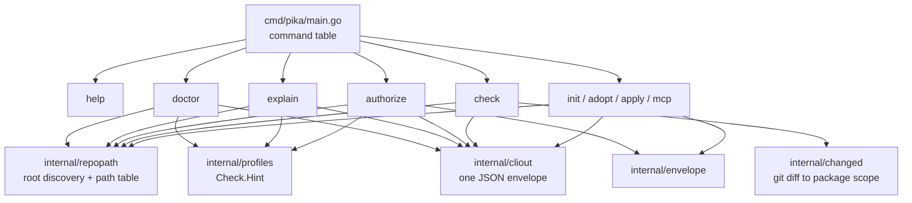

# pika M1.5 Design Specification — Ergonomics and Authority

**Status:** Approved
**Date:** 2026-08-29
**Product:** `pika`
**Supersedes:** nothing. Refines [2026-08-28-pika-design.md](2026-08-28-pika-design.md) §8.1, §10, §12.4, §16.

## 1. Purpose

M1 shipped a deterministic kernel that is correct and nearly unusable by hand. Five commands exist, all bound to the process working directory, with one line of help text, no diagnosis, no rule explanation, and a capability envelope that a human must author in YAML before any agent can mutate anything.

M1.5 makes the kernel pleasant to run by hand and safe to hand to an agent. It adds no LLM calls, no network client, and no agent loop. Every unit here is a prerequisite for `pika work` under the adapter model (§3), so none of it is throwaway.

## 2. Goals

1. Run any pika command from any subdirectory of a project.
2. Make the command surface self-describing: `pika`, `pika help`, `pika help <command>`.
3. Diagnose a project's health and toolchain without reading source (`pika doctor`).
4. Make every rule explainable at the point of failure (`pika explain <rule-id>`) — design spec goal 10.
5. Generate a correct capability envelope from a declared intent, removing the hand-authored-YAML barrier to agent use.
6. Close the envelope enforcement gap so `exec` is authorized wherever the kernel spawns processes on an agent's behalf.
7. Make `check --changed` real, so the inner development loop is fast.
8. Stop fresh repositories from passing verification while verifying nothing.
9. Make pika govern pika: a committed contract, and CI that runs `pika check --ci`.

## 3. Authority decision (binding)

The kernel never calls a model. This ratifies design spec §4.3 ("AI decides; the kernel transacts") and §10 ("`pika` does not implement a new LLM client or coding-agent loop in V1").

`pika work`, in a later milestone, will spawn the operator's existing agent harness as a subprocess according to `contract.agents.<role>.{runtime,provider,model,effort}` and serve it the kernel over `pika mcp`. Consequences binding on M1.5:

- No HTTP client, no provider SDK, and no new module dependency enters `go.mod`. The binary keeps its two direct dependencies.
- `pika check --ci` remains provably free of model calls (design spec §16) because no code path capable of one exists.
- `contract.agents` already has its first reader: `pika improve` resolves the builder role's runtime to spawn Codex (`cmd/pika/improve.go:127-140`, merged in `3431434`). That is adapter orchestration, exactly the model this section ratifies, so it confirms the decision rather than contradicting it. M1.5 must not repurpose those fields for anything else.

## 4. Non-goals

Deferred to M2/M3 and explicitly out of scope. Scope creep into any of these fails review:

- replacing `.project/state/board.jsonl` with a real store;
- write-scope lease semantics (conflict detection, expiry, holder identity);
- enabling `apply_plan`;
- `pika work`, `resume`, `status`, `upgrade`;
- runtime adapters of any kind;
- budget spend accounting;
- `.agents/` skills, roles, and teams scaffolding;
- profile kind and capability layers.

## 5. Current-state findings

Every claim below was verified against the tree at commit `716fc48`.

| Finding | Evidence |
|---|---|
| No repo-root discovery exists; all five commands hardcode `repoRoot := "."` | `cmd/pika/check.go:65`, `adopt.go:31`, `apply.go:30`, `mcp.go:23`, `init.go:41` |
| `.project/contract.yaml` is re-declared in four packages; `.project/profiles.lock` in three | `cmd/pika/check.go:18`, `initcmd/init.go:93,96`, `apply/apply.go:44,47`, `adopt/adopt.go:57`, `checks/gate1.go:18` |
| `--version` is matched against **every** argument, not `args[0]` | `cmd/pika/main.go:13-18` |
| **Live bug:** `pika improve --branch version` and `--agent version` print the version and exit **0**, doing nothing while reporting success. `improve` introduced the binary's first free-form string flags, so the hijack above is no longer theoretical | reproduced against `2f0c5c9` |
| Help is one hand-maintained stderr string; no `help` subcommand, no top-level `-h` | `cmd/pika/main.go:34` |
| `check` emits compact JSON; `adopt`/`apply`/`init` emit indented JSON; `init`'s JSON is built inside its internal package; `improve`/`handoff` add a sixth private writer | `check.go:117-123`, `adopt.go:36-38`, `apply.go:47-49`, `initcmd/init.go:564-580`, `improve.go:164-171` |
| `Check.Hint` is parsed and resolved but read by no consumer | `profiles/registry.go:119-124,174-179`; `verify/ladder.go:41-51` branches only on `Cmd`/`Discovery` |
| `--changed` is aliased to `--all` with a warning | `verify/verify.go:139-142`, flag help at `cmd/pika/check.go:34` |
| `envelope.Load` infers the repo root by three `filepath.Dir` calls | `envelope/envelope.go:238` |
| `authorizeWrite` is the only `envelope.Allows` call site in the binary; only `KindFSWrite` is ever checked | `mcp/server.go:733-742` |
| `run_checks` spawns contract-declared subprocesses with no `exec` authorization | `mcp/server.go:453-501` |
| `typescript@1` declares all five slots discovery-only, so a fresh TS repo passes `check` with every gate skipped | `profiles/packs/typescript@1.yaml:30-44` |
| The registry digest hashes all packs together, so adding or editing any pack rotates every repository's lock digest | `profiles/registry.go:385-398` |
| `checkLock` compares per-pack digests only; the top-level `digest` field is written and never verified | `profiles/registry.go:457-489` writes it; `checks/gate1.go:66-103` does not read it |
| `handoff` and `improve` are CWD-bound and use the pre-M1.5 three-argument command signature | `cmd/pika/improve.go:23,73`, `main.go:34-39` |
| **A fresh TypeScript repo makes `pika improve` a no-op**: every slot is discovery-only, nothing is discovered, all gates skip, the report passes, and `hasFailedGate` returns false — so improve reports a green baseline and repairs nothing | `profiles/packs/typescript@1.yaml:30-44`; `verify/ladder.go:44-48`; `cmd/pika/improve.go:155-162` |
| pika has no `.project/`, no `AGENTS.md`, and no CI workflow of its own | repository root |

## 6. Architecture

M1.5 adds five internal packages and rewrites the dispatcher. No existing package is restructured; `repopath` is threaded through as a parameter, not a global.



### 6.1 `internal/repopath` — root discovery and the path table

One exported type owns every `.project` path. Discovery walks up from a starting directory, stopping at the first match:

1. a directory containing `.project/contract.yaml`;
2. a directory containing `.project/contract.yaml.draft`;
3. a directory containing `.git`;
4. otherwise the starting directory, marked `origin: "cwd"`.

The walk stops at the filesystem root and never crosses above it. `Root` exposes `Dir()`, `Origin()`, and accessors for contract, lock, exceptions, drafts, state dir, envelope, board, evidence dir, and review path — replacing the duplicated string constants in `check`, `initcmd`, `apply`, `adopt`, `gate1`, and `envelope`.

Every command accepts `--root <dir>`, which bypasses discovery and is used by tests and by callers running pika out of tree.

`envelope.Load` stops inferring its root by directory arithmetic and takes an explicit root.

### 6.2 Dispatcher and help

`cmd/pika/main.go` becomes a table:

```go
type command struct {
    name    string
    summary string
    usage   string
    run     func(args []string, stdin io.Reader, stdout, stderr io.Writer) int
}
```

`pika` with no arguments and `pika help` render the table. `pika help <name>` prints that command's usage. Unknown command exits 2 with the table. Help text cannot drift from the registered set because it is generated from it.

`--version`, `-version`, and `version` are honored **only** as `args[0]`. This is a behavior change: `pika check --version` previously printed the version and now fails flag parsing. It is also a bug fix, not a refactor — `pika improve --branch version` currently exits 0 without improving anything, and `improve`'s free-form flags are why this must land before any further command grows one.

Dispatch stays stdlib `flag`. No CLI framework is added.

### 6.3 `internal/cliout` — one JSON envelope

Every `--json` payload is wrapped:

```json
{"schema": 1, "command": "doctor", "ok": true, "result": { }}
```

`result` is the existing per-command report type, unchanged, so no consumer of `verify.Report` or `adopt.Report` breaks in shape — only in nesting. Encoding is indented with two spaces and a trailing newline, everywhere. `init`'s manifest moves out of `internal/initcmd` and into the command layer.

`ok` is the boolean the exit code is derived from: `ok:false` implies exit 1. Usage and configuration errors (exit 2) are reported as `{"schema":1,"command":…,"ok":false,"error":{"code":…,"message":…}}` on stdout when `--json` was successfully parsed, and as plain text on stderr otherwise.

### 6.4 `pika doctor`

Read-only. Never mutates, never spawns a gate command. Reports:

- repository root and how it was resolved;
- contract presence, load result, and schema version against the binary's ceiling;
- lock presence and per-pack digest agreement;
- exceptions record load result;
- envelope presence, validity, and the capability classes it declares;
- for each of the five gate slots: the resolved command, or the pack `hint` when the slot is a discovery sentinel with nothing discovered — `doctor` is the first consumer of `Check.Hint`;
- `exec.LookPath` for each resolved or hinted `argv[0]`;
- git availability.

Each finding has a severity of `ok`, `warn`, or `error`, and a remediation string. Exit 0 when nothing is `error`, 1 when something is, 2 on usage error.

### 6.5 `pika explain <rule-id>`

Explains three id namespaces from one command: naming rule ids, gate ids, and MCP error codes. For a naming rule it prints the id, owning pack and version, severity, matcher summary, rationale, remediation options, and the exact `.project/exceptions.yaml` record that would waive it.

Rationale and remediation do not exist in the pack format today. `namingSpec` (`profiles/registry.go:102-109`) and `NamingRule` (`registry.go:192-199`) each gain `Rationale` and `Remediation` string fields, populated for the four `core@1` rules. Unknown id exits 2 and lists known ids.

### 6.6 `pika authorize`

Writes `.project/state/envelope.yaml`, which is gitignored and therefore local-only and machine-specific — correct for a capability grant.

Three scopes, deny-by-default beyond what each names:

| `--scope` | `fs_write` | `exec` |
|---|---|---|
| `read` | none | none |
| `project` (default) | `.project`, `docs`, `review` | `argv[0]` of every resolved gate command |
| `repo` | `.` | `argv[0]` of every resolved gate command |

`network`, `credential`, and `github` are never granted implicitly. They require `--network <host>`, `--credential <name>`, and `--github <scope>`, each repeatable. `budget` is not written, because nothing enforces it (§4); writing a ceiling that is never compared would be a lie of the same class this milestone removes elsewhere.

The envelope is printed for review before writing. An existing envelope is never silently replaced: without `--force` the command exits 1 and prints a diff of what would change.

`exec` entries are derived from the contract's resolved gates, so authorization matches what `check` will actually run. Bare `*` is rejected by `envelope.Validate` already (`envelope.go:128-133`) and `authorize` never attempts it.

Because `exec` derivation needs resolved gates, `authorize` requires a loadable contract for `--scope project` and `--scope repo`, and exits 2 pointing at `pika init` or `pika adopt` when there is none. `--scope read` grants no `exec` and therefore works on an unadopted repository.

### 6.7 Envelope enforcement closure

`mcp.(*server).authorizeWrite` generalizes to `authorize(kind, target string) error`. `toolRunChecks` gains a `KindExec` check per gate argv before execution, so an agent cannot run commands the operator did not authorize. Denial returns the existing `envelope_denied` code.

The human CLI is deliberately asymmetric: `pika check` run by a human enforces `exec` **only when an envelope file is present**. A human in their own shell must never have to authorize themselves. This asymmetry is intentional, is the kind of thing that rots silently, and is therefore covered by an explicit test in both directions.

`apply_plan` gains a distinct `unavailable` error code so an agent can tell "never available in this build" from "transient kernel failure" without string matching (`mcp/server.go:55-61,726-728`).

### 6.8 Real `--changed`

`internal/changed` resolves the changed set as `git diff --name-only <merge-base>...HEAD` plus the working-tree and staged diffs, deduplicated and normalized to repo-relative paths.

Scoping: a changed path maps to a package when it is under `contract.packages[<n>].root`. Gates run when at least one changed path maps into scope. When the contract declares no packages, any changed path selects all gates — the honest answer for a single-package repository.

Gate 1 (`contract`) always runs regardless of scope; it validates the contract itself.

Degradation is explicit, never silent: git absent, not a repository, shallow clone, or no merge base each produce a warning naming the cause and fall back to `All`. A gate skipped for scope reports `status:"skip"` with reason `"no changed files in scope"`, which is distinct from the existing discovery and cascade skips.

The `--changed is reserved` warning (`verify/verify.go:139-142`) and the flag's "reserved" help text are deleted.

### 6.9 Command population from hints

`init` and `apply` write a pack's `hint` argv into `contract.commands[<slot>]` when — and only when — `exec.LookPath(hint[0])` succeeds on the authoring machine. Slots whose tool is absent stay discovery sentinels, which is the honest outcome.

This closes the fresh-TypeScript-repo hole: `npm` present means `commands.test: npm test` is written and the gate actually runs.

Populated commands are listed in the init manifest and in the adoption review so the operator sees exactly what was inferred.

### 6.10 pika adopts pika

`pika adopt` then `pika apply` are run against this repository and the results committed: `.project/contract.yaml`, `.project/profiles.lock`, `.project/exceptions.yaml`, a root `AGENTS.md`, `.github/workflows/ci.yml` running `pika check --ci`, and `review/adoption-review.md`.

This is the milestone's acceptance evidence. A kernel that gates itself in CI proves more than any assertion this plan could add.

## 7. Decisions on two known inconsistencies

**Registry digest rotation.** Adding `rationale`/`remediation` to `core@1` changes the pack bytes, which rotates the top-level registry digest for every repository (`registry.go:385-398`). Accepted: pika is pre-1.0, and the failure is a loud, specific gate-1 error rather than silent drift. In the same change, `checkLock` begins verifying the top-level `digest` field it already writes. A lock field that is written and never checked is worse than no field.

**Dot-segment exemption.** `walkFiles` skips every dot-prefixed path segment (`checks/naming.go:262-268`), so `.project/` and `.github/` are exempt from pika's own naming and file-size rules. This becomes visible when pika adopts itself. Kept as-is and documented in `AGENTS.md`; changing traversal semantics mid-milestone would put every adopting repository's results in motion for a cosmetic gain.

## 8. Error handling

- Discovery failure is impossible by construction: the walk falls back to the start directory with `origin: "cwd"`.
- A `--root` that does not exist or is not a directory is a usage error, exit 2.
- `doctor` never fails on a missing contract; an unadopted repository is a valid, reportable state.
- `authorize` refuses to overwrite without `--force` and exits 1 having written nothing.
- `changed` degradation always warns with a cause and never silently narrows verification. Narrowing scope by accident is the one failure mode that would let a regression through, so the bias is always toward running more gates.
- Envelope denial keeps its existing `envelope_denied` code and fail-closed ordering: authorization precedes any filesystem or process effect.

## 9. Testing

Following existing patterns; no new test dependency.

- `repopath`: table test over synthesized trees — nested contract, draft-only, git-only, none, symlinked root, and a `--root` override.
- Dispatcher: `pika`, `pika help`, `pika help check`, `pika bogus`, and specifically `pika check --version` now exiting 2 — the regression test for the argv hijack.
- `cliout`: every command's `--json` output unmarshals to the envelope and carries the right `command` and `ok`.
- `doctor`: fixtures for healthy, unadopted, drifted-lock, missing-toolchain, and no-envelope, asserting severities and exit codes.
- `explain`: every `core@1` rule id resolves with non-empty rationale and remediation; an unknown id exits 2. A test asserts every resolved `NamingRule` has both fields populated, so a future pack cannot ship an unexplainable rule.
- `authorize`: golden envelope per scope; the generated envelope validates under `envelope.Validate`; `exec` entries match the resolved gates; refuse-without-`--force`; and — the important one — a generated `project` envelope actually authorizes the `run_checks` path it was generated for.
- Enforcement: MCP `run_checks` denied without `exec` authorization; the same check passing with a generated envelope; and `pika check` succeeding with no envelope file present.
- `changed`: git fixtures for no-change, in-scope, out-of-scope, no-packages-declared, no-git, and no-merge-base, asserting selected gates and warning text.
- Hint population: `init` with a stubbed `PATH` containing the tool, and without it, asserting the contract in each case.
- E2E (`internal/e2e`): `doctor`, `explain`, `authorize`, and `help` through the real binary; running `check` from a nested subdirectory. The five golden init trees change **content** as well as membership: hint population rewrites `commands:` in each golden `contract.yaml`, and because `PATH` differs per machine, the golden tests must stub `exec.LookPath` to a fixed answer so the goldens stay deterministic. This is the single largest test-fixture cost in the milestone.
- Tool-name assertions are duplicated at `mcp/server_test.go:305` and `e2e/e2e_init_test.go:467`; both are updated in lockstep when the `unavailable` code lands.

## 10. Completion definition

M1.5 is complete when:

1. every command runs correctly from a nested subdirectory and honors `--root`;
2. `pika`, `pika help`, and `pika help <command>` describe the real command set, generated from the dispatch table;
3. `pika check --version` exits 2, and `pika improve --branch version` runs improve instead of printing the version;
4. every `--json` payload shares the `cliout` envelope;
5. `pika doctor` reports root, contract, lock, exceptions, envelope, per-gate command or hint, toolchain presence, and git, with correct severities;
6. `pika explain` resolves every `core@1` rule id with rationale and remediation, and every gate id and MCP error code;
7. `pika authorize --scope project` produces an envelope that validates and that authorizes `run_checks` for the contract's own gates;
8. `run_checks` is denied without `exec` authorization, and `pika check` still runs with no envelope present;
9. `check --changed` selects gates from a real git diff, degrades loudly, and the "reserved" warning is gone;
10. a fresh `pika init --profile typescript` on a machine with `npm` produces a contract whose test gate actually executes;
11. pika's own contract, lock, exceptions, `AGENTS.md`, and CI workflow are committed, and `pika check --ci` passes on this repository in GitHub Actions;
12. `go test ./... -count=1` passes and `CGO_ENABLED=0 go build ./...` succeeds;
13. `go.mod` still declares exactly two direct dependencies.
14. `handoff` and `improve` honor `--root`, share the `cliout` envelope, and are registered in the dispatch table like every other command.

## 11. Execution order

The tasks are ordered to serve `pika improve`, which merged in `3431434` after this spec was drafted. `improve` is the milestone's real automation payload; every task below makes it more trustworthy. The order is:

| Order | Unit | Why here |
|---|---|---|
| 1 | §6.1 `repopath` | Dependency of `--root`. Already landed. |
| 2 | §6.2 dispatcher and argv fix | Removes a silent exit-0 from shipped code. Smallest change, largest safety delta. |
| 3 | §6.9 hint population | Without it `improve` has nothing to repair on a fresh repo, because every gate skips and the baseline reads green. |
| 4 | §6.1 `--root` threading | `handoff` and `improve` stop being bound to the working directory. |
| 5 | §6.4 `doctor` | Turns every `improve` refusal — dirty tree, missing builder config, absent toolchain — into an explanation. |
| 6 | §6.8 real `--changed` | Makes the improve loop fast enough to run habitually. |
| 7 | §6.6 `authorize`, §6.7 exec enforcement | Governs the external agent process `improve` spawns. |
| 8 | §6.3 `cliout`, §6.5 `explain`, §6.10 self-adoption | Consolidation and evidence. |

Dependencies still bind: `--root` needs `repopath`, `authorize` precedes exec enforcement, and self-adoption is last.
