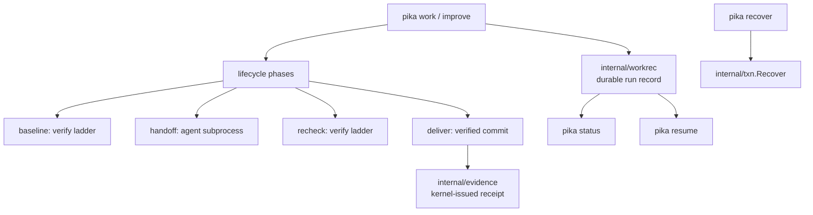
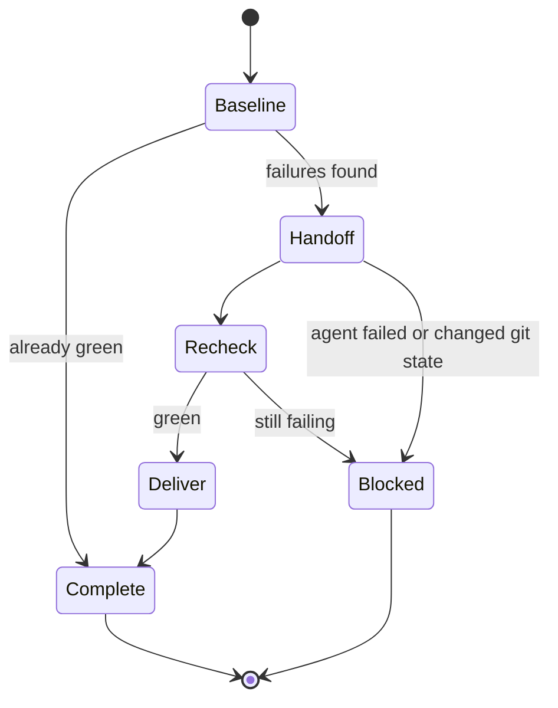

# pika M2 Design Specification — Durable Work and Kernel-Issued Evidence

**Status:** Approved
**Date:** 2026-08-30
**Product:** `pika`
**Builds on:** [2026-08-29-pika-m1-5-ergonomics-design.md](2026-08-29-pika-m1-5-ergonomics-design.md)
**Refines:** [2026-08-28-pika-design.md](2026-08-28-pika-design.md) §8.1, §9.3, §12, §14, §18

## 1. Purpose

M1.5 made the kernel legible. `pika improve` already automates the repair loop: it runs the ladder, hands only failed gates to an agent, re-verifies, and commits on a green recheck.

It has no memory. Nothing durable records that a run happened. An interrupted run leaves a branch, uncommitted agent edits, and an orphan bundle directory with no way to tell which run produced them. There is no `status`, no `resume`, and no reader for anything `improve` writes.

M2 gives the automation memory, and makes the kernel — not the agent — the thing that attests what happened.

## 2. Goals

1. Make a work run durable: survive interruption, be resumable, be queryable.
2. Generalize `improve`'s single-purpose loop into a lifecycle that also serves feature work.
3. Make the kernel the producer of evidence receipts, so completion claims are issued by the component that observed the work.
4. Recover from a crashed transaction without hand-editing lock files.
5. Close the M1.5 hardening debt that becomes load-bearing once runs are long and restartable.

## 3. Non-goals

Deferred to M3 and explicitly out of scope. Scope creep into any of these fails review:

- parallel writers, write-scope leases with conflict detection, and the arbitration they need;
- multi-agent collaboration, named messages, or a task graph with dependencies;
- `pika work` spawning more than one agent per run;
- provider fallback or model selection policy;
- enabling `apply_plan`;
- enforcement for `network`, `credential`, `github`, or `budget`;
- a web dashboard or any remote surface.

## 4. Current-state findings

Every claim verified against `main` at `9d7f62d`.

| Finding | Evidence |
|---|---|
| `improve` is a single-process, in-memory state machine; `improve.Result` is printed and never written | `internal/improve/improve.go:48-136` |
| The handoff bundle holds only `checks-before.json`, `prompt.md`, `codex-last-message.md` — no run id, no phase, no branch/commit linkage | `internal/improve/handoff.go:100-133` |
| `.project/state/` is gitignored, so bundles are local-only | `.gitignore:2` |
| No reader exists for the handoffs directory; an interrupted run cannot be identified, let alone resumed | repo-wide; no consumer |
| **Nothing in the binary produces an evidence receipt.** `evidence.Build`/`Write` are reachable only from MCP `publish_evidence`, where the agent supplies every field | `internal/mcp/server.go` publish_evidence; `internal/evidence/receipt.go:225` |
| **`txn.Recover` has no production caller.** The `O_EXCL` lock is never stolen, even when the holder PID is dead, so a crashed `apply` wedges every later transaction until an operator deletes the lock by hand | `internal/txn/journal.go` lock + `Recover`; no `pika recover` command |
| **`NewWorkID` is deterministic**: `sha256(slug ‖ 0x00 ‖ unix-seconds)[:2]`. Same slug in the same second yields the same id, overwriting the same evidence file | `internal/evidence/receipt.go:365-378` |
| The board has four writers and zero readers in non-test code | `internal/mcp/server.go` appendBoard |
| Capability enforcement covers exactly `fs_write` and `exec`, only inside `internal/mcp`. The CLI spawns processes and writes files with no envelope consultation | `internal/mcp/server.go`; `docs/reference/m1-5-delta.md` |
| **No re-entrancy guard exists anywhere.** No `PIKA_*` env var is read or set; `runConfig` carries no depth counter. The M1.5 incident is documented only as a testing convention | `internal/verify/verify.go:38-42`; `AGENTS.md` |
| `runGate` decides pass/fail purely on exit status, so `gofmt -l -w .` and `ruff format .` can never fail | `internal/verify/verify.go:259-262` |
| `rust@1` (`cargo fmt -- --check`) and `swift@1` (`swift format lint`) prove the defect is pack-local, not engine-local | `packs/rust@1.yaml:36`; `packs/swift@1.yaml:40` |
| `core@1`'s CI template emits a `paths:` filter omitting source dirs and `go install …@latest`, verifying a published release rather than the commit under test; pika's own workflow was hand-fixed and now diverges on four points | `packs/core@1/templates/ci.yml.tmpl` |
| `python@1` hardcodes `python -m pytest` as an unconditional `cmd`, not a hint, so PATH probing cannot avoid it on Debian | `packs/python@1.yaml:46-47` |
| `doctor` loads the envelope and prints gate argv in two functions that never talk, so it cannot warn that an envelope will deny `run_checks` | `internal/doctor/doctor.go:143,182` |

## 5. Architecture

### 5.1 `internal/workrec` — the durable run record

One directory per run: `.project/state/work/<work-id>/`, containing `record.json` plus the run's handoff bundle (relocated from `.project/state/handoffs/<unixnano>/`, which had no identity).

`record.json` holds: work id, goal, kind (`repair` or `feature`), phase, branch, base commit, the baseline and recheck reports, the agent role and runtime actually used, per-phase timestamps, and a terminal outcome (`complete`, `blocked` with reason, or `abandoned`).

Every transition is written atomically — temp file, fsync, rename, fsync parent — reusing the durability pattern `evidence.Write` already implements rather than inventing a second one. A crash between transitions leaves the last committed phase readable, which is exactly what `resume` needs.

**Storage decision (deviation from design spec §9.3/§18, deliberate).** The base spec calls for pure-Go SQLite in WAL mode. M2 does not adopt it, for two reasons. First, there is exactly one writer per run and no cross-run coordination until M3 introduces parallel builders — SQLite would buy arbitration nothing currently needs. Second, a pure-Go SQLite driver is a large dependency tree, and this project holds a hard two-direct-dependency constraint that has shaped every milestone so far. Revisit when M3 admits concurrent writers; the record format is deliberately a flat per-run document so that migration is a copy, not a redesign.

### 5.2 Work identity

`NewWorkID` becomes collision-resistant: the 4-hex suffix is drawn from a random source rather than `sha256(slug ‖ seconds)`. The existing `ValidateWorkID` pattern is unchanged, so ids remain `YYYYMMDD-slug-4hex` and existing receipts stay valid. Determinism was never a requirement — it was an artifact — and it silently made two same-second runs share one evidence file.

Creating a run whose directory already exists is a refusal, not an overwrite.

### 5.3 Lifecycle

`improve` becomes the `repair` kind of this lifecycle, keeping its exact current behavior and refusals. `work "<goal>"` adds the `feature` kind, which differs in one respect: its baseline is not expected to be red, so a green baseline proceeds to handoff with the goal as the prompt rather than short-circuiting.

Every existing safety property is preserved and must be re-asserted by tests: the dirty-tree refusal, branch-identity re-verification before commit, the git-state equality check after the agent returns, the pending-git-operation refusal, and the filter that prevents `.project/state` from ever being committed.

### 5.4 `pika status` and `pika resume`

`status` with no argument lists runs newest-first; with a work id, prints that run's phases, outcome, branch, and commit. `--json` through the `cliout` envelope like every other command.

`resume <work-id>` continues an interrupted run from its last committed phase. It refuses when the recorded branch no longer exists, when the working tree has diverged from the record's base commit, or when the run already reached a terminal outcome — recovering into a changed world silently is worse than refusing.

### 5.5 Kernel-issued evidence

At `Deliver`, the kernel builds and writes an `evidence.Receipt` from what it actually observed: the contract and profile-lock digests it loaded, the commit and tree it produced, the role and runtime it spawned, the changed files it committed, the gate commands it ran with exits and durations, the baseline failures and regressions it measured, and the completion state it reached.

This is the first receipt producer in the binary. It matters because today the only path to a receipt is an agent asserting its own success through `publish_evidence`; a receipt issued by the component that ran the gates is evidence, one supplied by the subject is a claim.

Receipts remain committed under `.project/evidence/`, distinct from the gitignored run record: the record is local operational state, the receipt is the public, redacted attestation.

### 5.6 `pika recover`

Exposes `txn.Recover`. Reports the journal state, what would be rolled back, and — with `--apply` — performs recovery and releases the lock. Without it, a crashed `apply` is unrecoverable without hand-deleting `.project/state/recovery/lock`, and nothing in the product tells the operator that.

`doctor` gains a finding for a stale transaction lock, pointing at `pika recover`.

## 6. Hardening

These are M1.5 deferrals that become load-bearing once runs are long, restartable, and agent-driven.

### 6.1 Re-entrancy guard

`pika check`'s test gate can invoke pika, whose suite invokes pika. This already fired once and saturated a machine.

`verify.Run` sets a marker in the spawned gate's environment recording nesting depth. On entry, if the marker indicates gates are already running, the ladder refuses with a clear error naming the outer run instead of recursing. This is the first `cmd.Env` manipulation in the codebase; today gates inherit the full parent environment untouched.

A convention in `AGENTS.md` is not a guard. The guard is structural, and the existing regression test stays as defence in depth.

### 6.2 A format gate that can fail

`runGate` decides pass/fail purely on exit status. `gofmt -l -w .` rewrites files and exits 0, so the gate is structurally incapable of failing — and it mutates the artifact under verification. `ruff format .` has the same shape. `rust@1` and `swift@1` already use checking forms, proving this is pack-local.

Packs gain a `fail-on-output` flag on a check. When set, a gate whose stdout is non-empty fails regardless of exit status. `go@1`'s format hint becomes `gofmt -l .` with the flag; `python@1`'s becomes `ruff format --check .`, which exits nonzero natively and needs no flag.

This is required because contract commands are exec'd with no shell (`strings.Fields`), so `test -z "$(gofmt -l .)"` is inexpressible.

Once the gate can fail honestly, pika's own hand-added `git diff --exit-code` CI step becomes redundant and is removed.

### 6.3 Pack and template corrections

- `core@1`'s `ci.yml.tmpl` converges with the workflow pika hand-fixed for itself: no `paths:` filter, `fetch-depth: 0`, a `permissions:` block, and building the kernel from the commit under test rather than `go install …@latest`.
- `python@1`'s `test` command stops hardcoding `python`, which does not exist on Debian/Ubuntu.
- Both changes rotate `PackDigest()`. That cost is paid once, here, together — M1.5 deliberately deferred the template fix to avoid a second rotation in one milestone.

### 6.4 `doctor` cross-checks the envelope

`doctor` already loads the envelope and resolves gate argv in two functions that never talk. It gains a finding when a resolved gate command is not authorized by the present envelope's `exec` grants — the one diagnostic that would have predicted an `envelope_denied` from `run_checks` before an agent hit it.

## 7. Error handling

- A missing or corrupt run record is reported, never repaired silently; `resume` refuses rather than guessing a phase.
- A work id collision is a refusal.
- `resume` refuses on a diverged tree, a missing branch, or a terminal outcome, each with a distinct message.
- Recovery never steals a live lock: `pika recover` reports a live holder and refuses; only a dead holder can be recovered, and the report says which case it saw.
- The re-entrancy guard refuses, it does not silently skip gates — a skipped gate reporting pass is the failure mode this milestone exists to prevent.
- Receipt building stays fail-closed: an unredactable field fails the build rather than emitting a receipt.

## 8. Testing

- `workrec`: atomic write under simulated crash between phases; a truncated record is reported not repaired; refusal on an existing id.
- Work id: statistical collision check across many same-second ids with an identical slug — the exact case that previously produced one id.
- Lifecycle: every transition, including each refusal, using the existing faked `Runner` boundary from `internal/improve`'s tests.
- `resume`: from each interruptible phase; refusal on diverged tree, missing branch, terminal outcome.
- Evidence: a completed run emits a schema-valid receipt whose commands, commit and completion match what the run actually did — asserted against the run record, not against hand-written input.
- `recover`: a journal from a killed process is recovered; a live lock is refused; the dead-holder path releases.
- Re-entrancy: a gate that invokes pika is refused with the guard's error, proven by a test that would hang or recurse without it.
- `fail-on-output`: a gate producing output with exit 0 fails; the same gate silent passes; `rust@1`'s existing checking form is unaffected.
- E2E: `work`, `status`, `resume`, `recover` through the real binary; goldens regenerated for the pack and template changes.

## 9. Completion definition

M2 is complete when:

1. a run's phases are durably recorded and survive process death;
2. `pika status` lists runs and prints one run's detail; `--json` uses the `cliout` envelope;
3. `pika resume` continues an interrupted run and refuses a diverged world with a distinct message per case;
4. `improve` is the `repair` kind of the shared lifecycle with every existing refusal and safety check preserved;
5. `pika work "<goal>"` runs the `feature` kind end to end;
6. a completed run emits a kernel-issued, schema-valid evidence receipt under `.project/evidence/`;
7. work ids are collision-resistant and an existing id is refused;
8. `pika recover` recovers a crashed transaction and refuses a live lock; `doctor` reports a stale lock;
9. a gate that re-enters pika is refused, structurally, not by convention;
10. the format gate can fail; pika's `git diff --exit-code` CI step is removed as redundant;
11. `core@1`'s CI template matches what pika uses on itself; `python@1` runs on Debian;
12. `doctor` warns when the envelope would deny a resolved gate;
13. `go test ./... -count=1` passes, `CGO_ENABLED=0 go build ./...` succeeds, `go.mod` still declares exactly two direct dependencies, and `pika check --ci` passes on this repository in GitHub Actions.
